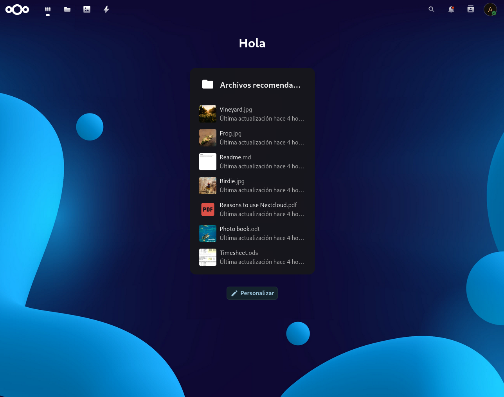
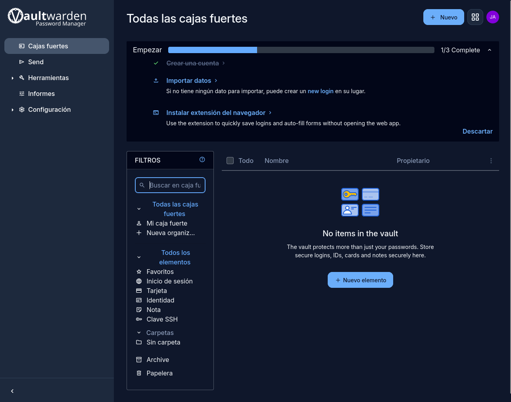
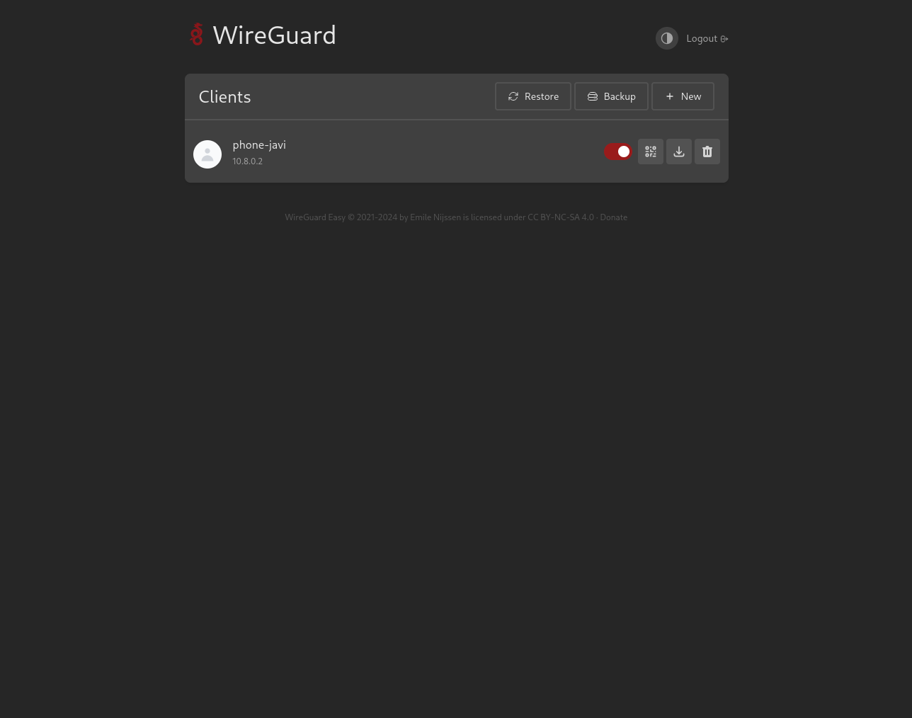

# MSP Docker Applications

Self-hosted application services deployed using Docker and Linux.

---

# Overview

This repository contains reusable self-hosted application stacks focused on:

- MSP environments
- Private cloud services
- VPN remote access
- Password management
- Secure self-hosted applications
- Modular Docker deployments

---

# Docker Host

## srv-docker-apps

Application server dedicated to customer-facing services.

---

# Services

## Nextcloud

Private cloud platform with:

- MariaDB backend
- Persistent storage
- HTTPS reverse proxy
- Internal DNS integration
- Secure remote access

---

## Vaultwarden

Self-hosted Bitwarden-compatible password manager.

Features:

- Secure credential storage
- HTTPS support
- Persistent storage
- Lightweight deployment

---

## WireGuard

VPN infrastructure using wg-easy.

Features:

- Remote access
- Mobile support
- Internal infrastructure access
- Easy client management

---

## Portainer Agent

Remote Docker host management integration.

---

# Features

- Docker Compose deployments
- Persistent volumes
- Reverse proxy integration
- Internal DNS support
- Wildcard SSL certificates
- Infrastructure modularization
- Reusable deployments
- MSP-oriented architecture

---

# Networks

- proxy_net
- backend_net

---

# Technologies Used

- Linux
- Docker
- Docker Compose
- WireGuard
- MariaDB
- Nextcloud
- Vaultwarden
- Git
- GitHub

---

# Screenshots

## Nextcloud

---

## Vaultwarden

---

## WireGuard

---

# Philosophy

Containers are disposable.

The important parts are:

- /opt/stacks
- /opt/data

Infrastructure should be:

- modular
- reproducible
- documented
- reusable

---

# Future Improvements

- Authentik SSO
- Automated backups
- Ansible deployments
- Centralized monitoring
- CI/CD integration

---

# Status

Project currently under active development.

